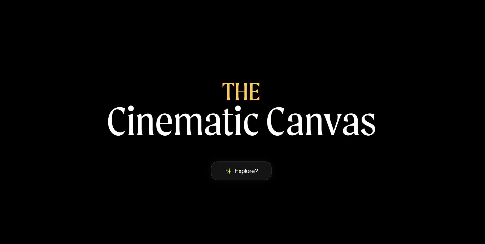
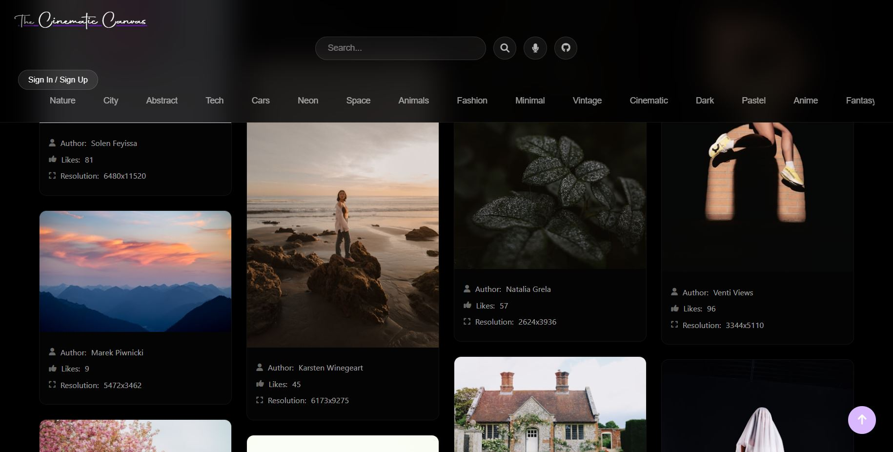

<h1 align="center">🎬 The Cinematic Canvas</h1>

  <b>A visually immersive wallpaper app that blends cinematic aesthetics with smooth UX.</b> 
  <i>Built with passion for design, motion, and creativity.</i>

---

## 🌌 Preview

  

  

---

## ⚙️ Tech Stack

  
  
  
  
  
  

---

## 🚀 Features

- 🌃 **Cinematic theme** with spotlight and dark mode
- 🧊 **Glassmorphism UI** components
- 🎯 **GSAP** driven animations
- 🔍 Category-based filtering
- 📷 Preview mode with resolution and author info
- ⏳ Lightweight and blazing fast
- 🔐 Integrated authentication using **Clerk**
- 💫 Smooth scrolling powered by **Lenis**

---

## 📂 Folder Structure

├── index.html
├── style.css
├── script.js
├── assets/
│ ├── land.JPG
│ └── app.JPG
├── README.md

---

## 📬 Get in Touch

> Made with 💜 by [Hunain Sualeh](https://github.com/Hunainsualeh)  
> Feel free to ⭐ this repo if you love the vibe!

---

